<h1 align="center">FitForm Live</h1>

<p align="center">
  웹캠의 2D pose를 실시간 운동 반복 판정으로 연결하고<br>
  <strong>영상·관절 동기화, cycle annotation과 외부 사용자 검증</strong>까지 구축한 브라우저 영상처리 프로젝트
</p>

<p align="center">
  <a href="#quick-start"><strong>실행하기</strong></a>
  ·
  <a href="portfolio/index.html"><strong>알고리즘 포트폴리오</strong></a>
  ·
  <a href="evaluation/python-validation/video-session-comparison/external-diagonal-target-arm-p5-final.json"><strong>P5 결과</strong></a>
  ·
  <a href="docs/ENGINEERING_DECISIONS_AND_ISSUES.md"><strong>의사결정 기록</strong></a>
</p>

<p align="center">
  
  
  
  
  
  
</p>

> FitForm Live v1은 **diagonal camera view에서 사용자가 지정한 한쪽 팔의 curl**을
> 독립적으로 카운트합니다. strict front·side와 양팔 합산 카운트는 현재 지원
> 범위가 아닙니다.

---

## 프로젝트 소개

Pose model이 관절 좌표를 반환하는 것만으로는 안정적인 운동 카운터가 되지 않습니다.
카메라 구도, 관절 confidence, 좌표 흔들림, 순간 가림과 사용자별 ROM 차이를
처리하고, 실제 영상에서 어떤 반복을 맞히고 놓쳤는지 검증해야 합니다.

FitForm Live는 이 문제를 두 개의 연결된 경로로 다룹니다.

```text
실시간 제품 경로
Webcam → MoveNet → joint validation → EMA → elbow angle
       → time-based FSM → target-arm rep count → JSON/CSV

검증 경로
Recorded video + pose trace → synchronized review
       → cycle annotation → prediction matching → TP / FP / FN
```

Microsoft AI School 8기 팀 프로젝트로 시작했으며, 이후 실시간 데모를 넘어
알고리즘의 선택 이유, 실패 사례와 재현 가능한 평가 근거를 보강했습니다.

## 핵심 결과

| 구분 | 결과 |
| --- | --- |
| Target-arm MVP | 해부학적 `left/right` 선택, 선택 팔만 독립 카운트 |
| 자체 정상·빠른 동작 | 각각 10/10 카운트 |
| 부분 동작 | production FP 2, exploratory FSM FP 0 |
| 가림 세션 | 5회 중 3회 검출, 가림 중 FP 0 |
| External development | GT 22, TP 15, FP 0, FN 7 |
| Frozen holdout | GT 25, TP 17, FP 0, FN 8 |
| Holdout count-level metric | Precision 1.000, Recall 0.680, F1 0.810 |
| Replay parity | 브라우저 기록과 capture-parity replay 일치 |
| 자동 검증 | JavaScript 45개, Python 28개 테스트 통과 |

개발용 diagonal 영상 4개와 설정 동결 후 추가한 **새 사용자 holdout 영상
3개**를 분리해 평가했습니다. Holdout은 모든 영상에서 추론 전 해부학적
왼팔을 등록했고, 결과 확인 후 threshold 변경이나 sample 제외를 하지 않았습니다.
정답은 AI-assisted 전체 영상 검수이므로 count-level 결과만 성능 근거로 사용합니다.

## Demo

<p align="center">
  
</p>

```text
운동 선택
  → target arm 선택
  → diagonal view에서 관절 노출 확인
  → 3초 countdown
  → 실시간 skeleton·angle·phase·rep 확인
  → 세션 JSON/CSV 저장
```

## 주요 기능

### 1. 브라우저 실시간 pose pipeline

- TensorFlow.js MoveNet SinglePose Lightning
- 선택 팔의 shoulder·elbow·wrist confidence 및 화면 경계 검사
- EMA 기반 keypoint 평활화
- 2D elbow angle과 시간 기준 angular velocity 계산
- Canvas skeleton·관절 상태·운동 feedback 표시

### 2. 시간 기반 repetition FSM

- `READY → BOTTOM_HOLD → RETURNING → READY + 1 rep`
- contraction과 extension에 각각 180ms hold 적용
- 8° hysteresis로 임계값 인접 진동 억제
- 1초 이상 tracking invalid 시 진행 중인 불완전 cycle만 초기화
- FPS가 아니라 elapsed time을 사용해 기기별 frame rate 영향 완화

### 3. Target-arm 제품 계약

- `targetArm = left | right`
- 왼팔 MoveNet index `5/7/9`, 오른팔 `6/8/10`
- 한팔·동시 양팔·교대 양팔 입력에서 선택 팔만 카운트
- 세션 진행 중 target arm 변경 잠금
- fixture, recording JSON과 CSV에 target arm 저장

### 4. 영상 품질과 성능 계측

- OpenCV.js grayscale·Laplacian variance 기반 밝기·선명도 분석
- 낮은 조도, 흐림, 관절 가림과 화면 이탈 안내
- MoveNet model load 및 inference latency
- frame processing average·P50·P95·max
- valid joint rate와 EMA FPS

### 5. 재현 가능한 평가 도구

- 영상과 pose timestamp 동기화
- frame별 skeleton overlay와 angle timeline
- machine candidate와 human annotation provenance 분리
- cycle-level `valid_rep`, `partial_rep`, `tracking_failure` annotation
- prediction과 GT event matching을 통한 TP·FP·FN
- 외부 MP4 browser-compatible transcode와 headless analysis runner

## 기술 스택

| 영역 | 기술 | 역할 |
| --- | --- | --- |
| Runtime | JavaScript, HTML, CSS | 브라우저 UI와 실시간 inference loop |
| Pose | TensorFlow.js, MoveNet Lightning | 17개 신체 keypoint 추정 |
| Vision | OpenCV.js | 밝기와 Laplacian 선명도 분석 |
| Rendering | Canvas API | video frame, skeleton과 상태 overlay |
| Capture | MediaDevices, MediaRecorder | 웹캠과 동기화된 세션 기록 |
| Evaluation | Python, OpenCV, pandas, Pydantic | annotation·동기화·지표 계산 |
| JS Test | Vitest | FSM·fixture·replay·target-arm 회귀 검증 |
| Python Test | pytest | schema·annotation·evaluator·video sync 검증 |

## 아키텍처

실시간 판정의 source of truth는 JavaScript에 두고, Python은 JavaScript 결과를
다시 구현하는 대신 기록된 trace의 계약 검증과 평가를 담당합니다.

```mermaid
flowchart LR
    C[Webcam] --> M[MoveNet Lightning]
    M --> V[Joint Validation]
    V --> E[EMA Smoothing]
    E --> A[Target-arm Angle]
    A --> F[Time-based FSM]
    F --> U[Live Count & Feedback]
    U --> R[Session Recorder]

    R --> J[Video + Pose JSON]
    J --> S[Python Video Sync]
    S --> H[Cycle Annotation]
    H --> P[Prediction Matching]
    P --> Q[TP / FP / FN Report]
```



```text
web/
  index.html                 product UI and inference loop
  js/pose-algorithms.js      angle, EMA and repetition FSM
  js/target-arm.js           left/right input contract
  js/video-session-recorder.js

python/
  app/annotation_app.py      synchronized review UI
  src/fitform_eval/          schema, annotation and evaluator

evaluation/
  python-validation/         reviewed annotations and reports
```

## 대표적인 기술적 문제 해결

### Pose tracking 실패와 FSM 일반화 실패 분리

첫 외부 side-view 영상에서 반복 파형은 존재했지만 production count는 0이었습니다.
단순히 “MoveNet이 실패했다”고 결론 내리지 않고 joint valid rate, angle range와
FSM event를 분리해 분석했습니다.

```text
joint valid rate > 90%
repeated angle excursion exists
production count = 0
→ pose loss가 아니라 view-sensitive 2D angle/FSM 문제
```

side 영상 하나에 맞춰 `60° → 70°`로 즉시 바꾸면 자체 partial curl의 FP가 다시
늘어날 수 있어 threshold 변경을 보류했습니다. strict side는 diagnostic으로
남기고 v1의 지원 범위를 diagonal target-arm으로 명시했습니다.

### 오른팔 고정 구현을 target-arm 계약으로 전환

초기 웹캠 알고리즘은 오른팔을 기준으로 개발됐습니다. 외부 교대 curl을 제품
정의와 일치시키기 위해 결과를 보고 잘 나온 팔을 사후 선택하는 대신, 분석 전에
사용자가 팔을 고정하도록 변경했습니다.

```text
Before: right shoulder / elbow / wrist 고정
After : targetArm 사전 선택 → 좌우 mapping → 동일 FSM
```

좌우 대칭 synthetic replay와 기존 오른팔 canonical fixture를 함께 테스트해
왼팔 지원 추가가 기존 결과를 바꾸지 않도록 했습니다.

### 자동 후보와 ground truth 분리

Prediction timestamp를 그대로 정답으로 승인하면 FN을 찾을 수 없고 recall이
과대평가됩니다. 따라서 다음 두 단계를 분리했습니다.

1. production candidate를 영상으로 확인해 FP 판정
2. 영상을 처음부터 끝까지 검수해 candidate가 없는 실제 반복을 추가

sample4에서 이 절차로 자동 후보 1개 외에 FN 7개를 확인했습니다.

## External diagonal 개발 평가

| Sample | Target | GT | Prediction | TP | FP | FN | Recall |
| --- | --- | ---: | ---: | ---: | ---: | ---: | ---: |
| sample1 | right | 7 | 7 | 7 | 0 | 0 | 1.000 |
| sample2 | left | 3 | 3 | 3 | 0 | 0 | 1.000 |
| sample3 | left | 4 | 4 | 4 | 0 | 0 | 1.000 |
| sample4 | left | 8 | 1 | 1 | 0 | 7 | 0.125 |
| **합계** | - | **22** | **15** | **15** | **0** | **7** | **0.682** |

sample4의 joint valid rate는 96.8%였지만 `60° 이하 + 180ms 유지 + 155° 이상
복귀`를 완전히 충족한 cycle은 1개뿐이었습니다. 오검출은 없었지만 사용자별
수축각과 hold 차이에 민감하다는 한계가 드러났습니다.

> sample1~3의 completion timestamp는 prediction-assisted review에서 파생됐으므로
> 0ms latency를 독립 성능 근거로 사용하지 않습니다. P5의 확정 결과는
> count-level TP·FP·FN입니다.

원본 요약은
[`external-diagonal-target-arm-p5-final.json`](evaluation/python-validation/video-session-comparison/external-diagonal-target-arm-p5-final.json)에
있습니다.

## 검증 전략

```text
Unit
  → angle / EMA / FSM / target-arm mapping
Integration
  → recorded sequence / canonical fixture / ablation
Capture parity
  → browser event == offline replay event
Cycle review
  → synchronized video + pose + annotation
External development
  → preregistered target arm + frozen threshold
Final holdout
  → new subject, preregistered arm, frozen configuration
```

## Frozen diagonal holdout

| Sample | Movement | Target | GT | Prediction | TP | FP | FN | Recall |
| --- | --- | --- | ---: | ---: | ---: | ---: | ---: | ---: |
| test1 | bilateral/alternating | left | 7 | 5 | 5 | 0 | 2 | 0.714 |
| test2 | alternating | left | 7 | 7 | 7 | 0 | 0 | 1.000 |
| test3 | simultaneous bilateral | left | 11 | 5 | 5 | 0 | 6 | 0.455 |
| **합계** | - | - | **25** | **17** | **17** | **0** | **8** | **0.680** |

새 사용자에서도 false positive는 발견되지 않았지만, test3의 target-left
joint valid rate가 82.9%로 낮아지고 일부 cycle이 `155° 복귀` 또는
`60° + 180ms` 경로를 완전히 충족하지 못했습니다. 따라서 고정 설정은
정밀도 1.000을 유지했지만 재현율 0.680에 머물렀습니다. 이 결과를 보고
threshold를 재조정하면 holdout의 의미가 사라지므로 v1 결과는 그대로 보존합니다.

원본 요약은
[`external-diagonal-target-arm-holdout-final.json`](evaluation/python-validation/video-session-comparison/external-diagonal-target-arm-holdout-final.json)에
있습니다.

```powershell
npm install
npm.cmd test

Set-Location python
python -m pip install -e ".[annotation]"
python -m pytest -q
```

현재 자동 검증은 JavaScript 45개와 Python 28개입니다.

## Quick Start

### 브라우저 앱

별도 frontend build는 필요하지 않습니다. 저장소 루트에서 HTTP server를
실행합니다.

```powershell
python -m http.server 8000 --directory web
```

Chrome 또는 Edge에서 <http://localhost:8000>을 엽니다.

1. 카메라 권한을 허용합니다.
2. `Target-arm Curl`과 해부학적 `left/right`를 선택합니다.
3. 선택 팔의 어깨·팔꿈치·손목이 보이는 diagonal view를 맞춥니다.
4. 운동을 시작하고 실시간 angle·phase·count를 확인합니다.
5. 필요하면 세션 JSON/CSV를 다운로드합니다.

### Annotation UI

```powershell
Set-Location python
python -m pip install -e ".[annotation]"
$env:PYTHONPATH = "src"
python -m streamlit run app\annotation_app.py
```

세션 JSON과 동일한 영상 파일을 업로드하면 frame·pose overlay, angle trace,
candidate review와 cycle annotation을 사용할 수 있습니다.

## 주요 설계 결정과 Trade-off

| 결정 | 선택 | 감수한 한계 |
| --- | --- | --- |
| Runtime | 브라우저 내 TensorFlow.js | 설치 없이 실행되지만 기기·WebGL 성능 영향 |
| Pose model | MoveNet SinglePose Lightning | 낮은 지연시간 대신 다중 인체·3D pose 미지원 |
| Repetition | 설명 가능한 time-based FSM | 학습 데이터가 적어도 재현 가능하지만 threshold 민감 |
| Arm policy | 사용자가 target arm 사전 선택 | 자동 best-arm보다 정직하지만 사용자 입력 필요 |
| View policy | diagonal v1 범위 | 검증 가능한 범위를 얻는 대신 front·side 비지원 |
| Smoothing | EMA `alpha=0.35` | 구현이 단순하지만 빠른 동작에서 지연 가능 |
| Ground truth | candidate approval + full-video audit | 검수 비용이 들고 일부 timestamp는 완전 독립이 아님 |
| Threshold | 개발 실패 후에도 frozen 유지 | sample4 recall을 희생하지만 사후 과적합 방지 |

결정 과정과 대안은
[`ENGINEERING_DECISIONS_AND_ISSUES.md`](docs/ENGINEERING_DECISIONS_AND_ISSUES.md)에
문제·해결방안·선택 이유 형식으로 기록했습니다.

## 현재 한계와 다음 과제

- Frozen diagonal holdout은 3개 영상·25회 규모여서 넓은 모집단을 대표하지 않습니다.
- sample4에서 GT 8회 중 7회를 놓쳐 고정 절대각·hold 기준의 한계가 확인됐습니다.
- Holdout에서도 GT 25회 중 8회를 놓쳐 높은 precision과 낮은 recall의
  trade-off가 재현됐습니다.
- strict front·side와 양팔 합산 count는 지원하지 않습니다.
- 2D 관절각은 카메라 방향, 원근과 keypoint 겹침의 영향을 받습니다.
- 단일 인체만 추정합니다.
- 밝기·선명도는 사용자 ROI가 아닌 전체 frame을 분석합니다.
- 스쿼트는 현재 왼쪽 다리 기준의 초기 기능이며 curl만큼 검증되지 않았습니다.
- 운동 feedback은 의료 진단이나 부상 방지를 보장하지 않습니다.

## 문서

- [MVP 범위 및 검증 정책](docs/MVP_SCOPE_AND_VALIDATION_POLICY.md)
- [Target-arm 구현 계획](docs/TARGET_ARM_MVP_IMPLEMENTATION_PLAN.md)
- [P5 최종 평가 JSON](evaluation/python-validation/video-session-comparison/external-diagonal-target-arm-p5-final.json)
- [영상 세션·FSM 비교](docs/VIDEO_SESSION_FSM_COMPARISON_2026-07-30.md)
- [Python 검증 계획](docs/PYTHON_VALIDATION_PLAN.md)
- [외부 데이터셋 조사](docs/PUBLIC_EXERCISE_DATASET_RESEARCH_2026-07-30.md)
- [전체 문제·의사결정 기록](docs/ENGINEERING_DECISIONS_AND_ISSUES.md)
- [영상 알고리즘 HTML 포트폴리오](portfolio/index.html)

## 프로젝트 배경

이 프로젝트는 Microsoft AI School 8기 1차 팀 프로젝트로 시작했습니다.

원 프로젝트 참여자:

- [김서현](https://github.com/bauhaus-k)
- [이동현](https://github.com/oliverlee9292)
- [고영현](https://github.com/henryeffel)
- [이재현](https://github.com/medori9999)
- [박진희](https://github.com/15nayana1021)
- [이누리](https://github.com/Leenurii)

---

<p align="center">
  실시간 데모뿐 아니라 <strong>실패 사례, 검수 provenance, 선택 이유와 남은 한계</strong>를 함께 기록하는 프로젝트입니다.
</p>
