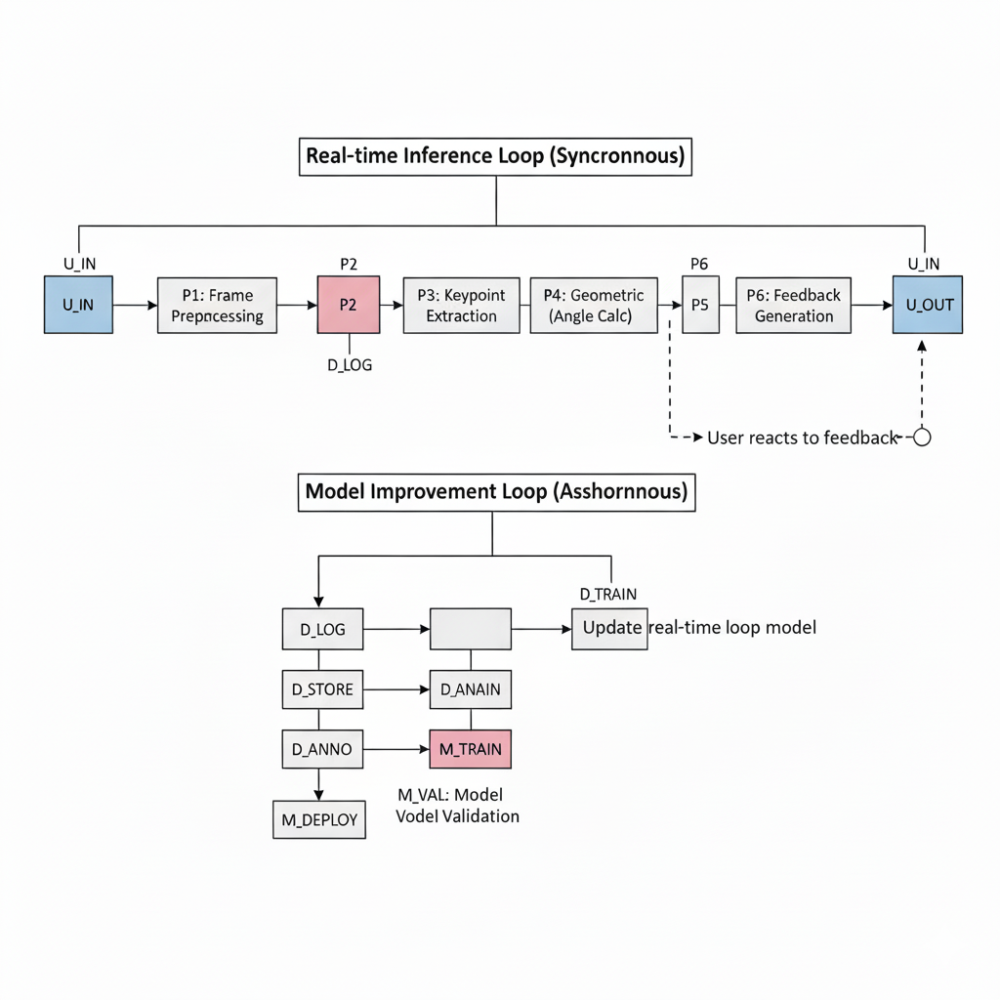

# FitForm Live
Microsoft AI School Cohort 8, First Team Project(20251111 ~ 20251121)

## 📌 Summary

-   🎯 Master your Form, **Prevent Injury** and **Be Healthy**.
-   🤔 **Why** this project exists
    -   🚧 The Reality Beginners Face : Most beginners struggle to learn proper exercise form. 
    -   📣 Pain Points : Injury Risk, Lack of Feedback, Financial Burden, Lack of Motivation
-   🚀 **How** we solved it
    -   🛠️ Browser-based pipeline combining webcam input, **MoveNet pose estimation**, and joint-angle analysis.
    -   🖼️ Real-time pose visualization, repetition counting, and immediate form feedback.

## 👀 How does it work?

## ⚙️ Pipeline

  
  
  

## 🧑🏻‍💻 Developers

  <table align="center">
    <tr>
      <td align="center"></td>
      <td align="center"></td>        
      <td align="center"></td>
      <td align="center"></td>
      <td align="center"></td> 
      <td align="center"></td> 
    </tr>
    <tr>
      <td align="center"><a href="https://github.com/bauhaus-k">김태훈</a></td>
      <td align="center"><a href="https://github.com/oliverlee9292">이동현</a></td>
      <td align="center"><a href="https://github.com/henryeffel">고영후</a></td>
      <td align="center"><a href="https://github.com/medori9999">이재웅</a></td>
      <td align="center"><a href="https://github.com/15nayana1021">허진호</a></td>
      <td align="center"><a href="https://github.com/Leenurii">이누리</a></td>   
    </tr>
    <tr>
      <td align="center" style="min-width: 220px;">
        
Project Management

        
Presentation design

        
Demo video

      </td>
      <td align="center" style="min-width: 220px;">
        
Architecture design

        
Code integration

        
Server integration

      </td>
      <td align="center" style="min-width: 220px;">
        
Pose Model ML

        
Pose Model Evaluation

        
Regression Model Test

      </td>
      <td align="center" style="min-width: 220px;">
        
Pose Model ML

        
Pose Visualization

        
Code integration

      </td>
      <td align="center" style="min-width: 220px;">
        
Pose Model ML

        
Pose Feedback

        
Web App

          </td>
      <td align="center" style="min-width: 220px;">
        
Demo video

      </td>
    </tr>
  </table>

